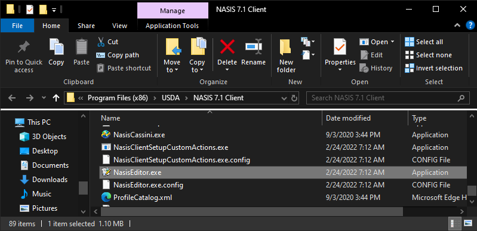

{width=25%}

**Pre-Course Assignment**

## Open the NASIS Client

### Locate the NASIS Editor

Locate the NASIS Editor Client Software and execute it by browsing to the shortcut in the windows start menu. You will find it within the folder "USDA Applications":

{width="25%"}

### Alternate Method

If the program is not present in the start menu, try to browse to the directory the program is stored in using Windows Explorer, typically the NASIS Editor client is located in "C:\\Program Files (x86)\\USDA\\NASIS 7.1 Client" the program file name you will need to open is "NASISEditor.exe".

### Request Support if Needed

If you are still unable to locate the NASIS Editor Client Software, it is possible it has not yet been installed on your computer. You should request installation assistance from an Information Technology Specialist via the OCIO Help Icon shortcut on the desktop or via the OCIO Help Icon on the windows taskbar. If you are not a USDA employee, you can find additional information on NASIS installation [here](https://new.cloudvault.usda.gov/index.php/s/xFTJabHiT45WDom).

## Login to NASIS and Initialize

### Network Requirement

The NASIS Editor requires a network or internet connection the first time it runs to configure and set up the local database. You will not be able to use the Editor until this is complete. Once the editor is configured it is possible to work in a disconnected mode, but the tasks you are able to perform are limited.

### Login Window

When you have successfully launched the NASIS Editor you will see a window appear which will either attempt to sign you in to the software automatically using desktop single sign-on, or you may need to select your sign-in method and enter the appropriate credentials. This could be using your LincPass card and PIN, or your eAuth username and password if you do not have a LincPass. If you do not have an account you can find additional instructions for requesting a NASIS account [here]("https://www.nrcs.usda.gov/wps/portal/nrcs/detail/soils/survey/tools/?cid=nrcs142p2_053551#accounts").

{width="50%"}

### Initialize the local database

When the login completes successfully, you will see a message that you must first initialize the local database before you can start using the software. This will take some time to complete, be patient! You can continue to use your computer while this finishes and you can observe the progress by viewing the progress window. When the process completes, the editor will open and will be ready to use. The editor window will appear as below.

## View the About NASIS Help Screen

### Locate the Help Menu

The help menu can be accessed by clicking the "Help" text on the upper left part of editor which also contains other text for menus such as "NASIS", "Queries Explorer", and "Editor".

{width=50%}

### Open the About NASIS Window

The help menu opens to reveal a list of options to select. Choose the "About..." option by clicking it.

{width=25%}

The About NASIS window shows the NASIS Client Installed Version Number, Metadata Data Model Version, and Database File Size. This information can be shared with support staff to assist in troubleshooting issues with the NASIS Editor if needed.

{width=50%}

## Complete and Submit Assignment

### Capture a Screenshot and Send to Your Mentor

Capture a screenshot of the About NASIS window using the print screen key on your keyboard, and email it to your mentor to confirm you have the correct version of NASIS installed and it is ready to use in the upcoming training session.

## Additional Resources

[USDA-NRCS NASIS Website](https://www.nrcs.usda.gov/wps/portal/nrcs/detail/soils/survey/tools/?cid=nrcs142p2_053552)

